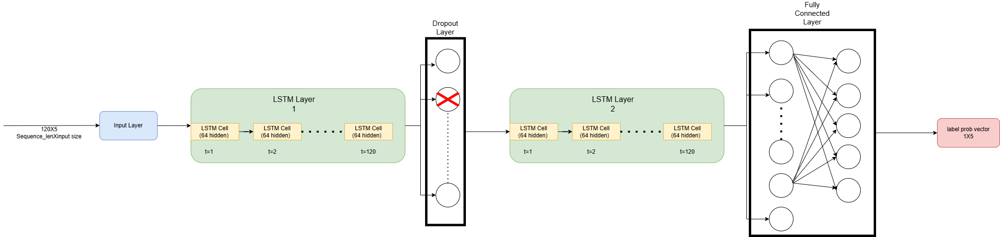
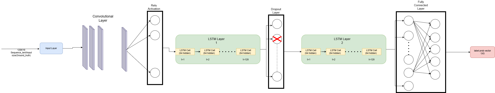
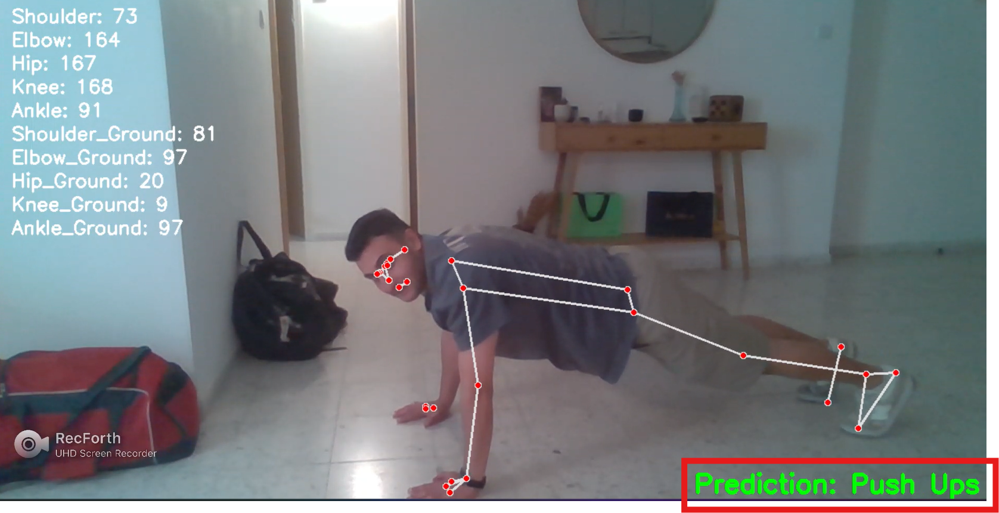

# 🏋️‍♂️ RTEC-Real-Time-Exercise-Classification
This project builds a **real-time physical exercise classification system** using computer vision, pose estimation, and deep learning. It captures a user's movements through a webcam, extracts key body joint angles using **MediaPipe**, and feeds a sequence of these angles into a trained **CNN-LSTM model** to classify the performed exercise.

---

## 📌 Project Overview
The goal of this project is to **accurately recognize exercises** (e.g., Squats, Push Ups, Pull Ups) in real time, using only a standard webcam. The system uses:
- **Pose Estimation** to detect body landmarks.
- **Angle Feature Extraction** to describe body posture.
- **Sequence Modeling** with CNN and LSTM to capture temporal patterns.
- **Live Classification & Feedback** with OpenCV display.
  
This can be used for:
- Fitness tracking
- Rehabilitation feedback
- Educational or sport-tech applications

---

## 🧍 Pose Detection with MediaPipe

[MediaPipe](https://mediapipe.dev/) is a Google framework for efficient machine learning pipelines. We used:

- **MediaPipe Pose**: Detects 33 body landmarks from an RGB video frame in real time.
- We extract only key **left-side landmarks** (shoulder, elbow, wrist, hip, knee, ankle, foot).

From these landmarks, we compute:
- **Joint Angles** (e.g., elbow, knee) using 3-point geometry
- **Ground Angles** (e.g., torso orientation relative to horizontal)

These 10 angles per frame become the input features for our models.

## 📊 Data

We used data from the following Kaggle dataset:  
🔗 [Exercise Detection Dataset – Kaggle](https://www.kaggle.com/datasets/mrigaankjaswal/exercise-detection-dataset)

- The dataset contains **pose landmarks** extracted using MediaPipe for 5 exercises: Push Ups, Pull Ups, Squats, Jumping Jacks, and Russian Twists.
- Each row includes **coordinates of body joints** along with the corresponding exercise label.
- From these, we computed **10 angle features** per frame (5 joint angles + 5 ground angles) and created labeled sequences of **120 frames** for training our models.

  ---
  ## 🧠 Models & Architectures

We experimented with both classical machine learning and deep learning approaches to classify exercises based on pose-derived features.

### 1. **Random Forest (All Features)**
- Uses all 10 angle features (5 joint + 5 ground angles).
- Trained on flattened sequences (averaged or reduced) to classify exercises.
- Serves as a strong baseline for comparison.

### 2. **Random Forest (Without Ground Angles)**
- Uses only 5 biomechanical joint angles as input.
- Useful for analyzing the importance of ground-relative orientation in exercise classification.

---

### 3. **LSTM**
Used to model temporal sequences of body movement:
- Input: `(batch_size, 120, 5)` — 5 joint angles over 120 frames
- Architecture:
  - `nn.LSTM` with 2 layers
  - Hidden size: 64
  - Dropout: 0.3
  - Output: Fully connected layer mapping to 5 exercise classes

---

### 4. **CNN + LSTM**
Improved version with a 1D Convolutional layer before the LSTM (using al features):
- `Conv1D`: Captures local temporal patterns across angle sequences
- `LSTM`: Captures long-term sequential dependencies
- Architecture:
  - Conv1D: 10 input channels → 64 filters, kernel size = 5
  - ReLU activation
  - LSTM: input size = 64, hidden size = 64, 2 layers, dropout = 0.3
  - Fully connected layer: 64 → 5 classes

This hybrid model achieved the best results in terms of accuracy and robustness.

---

## 🧪 Results

| Model                     | Accuracy | F1 Score | AUC   |
|--------------------------|----------|----------|-------|
| Random Forest (All)      | 0.951    | 0.943    | 0.925 |
| Random Forest (No Ground)| 0.963    | 0.957    | 0.942 |
| LSTM (No Ground)         | 0.981    | 0.977    | 0.960 |
| **CNN + LSTM (All)**     | **0.995**| **0.983**| **0.960** |

- CNN-LSTM achieved the best performance by combining spatial and temporal modeling.
- Removing ground angles slightly reduced model performance.

---

## 🎥 Real-Time Classification

- Once the model is trained, it is deployed in a live webcam application.
- MediaPipe detects pose → angles are extracted & smoothed → 120-frame sequence is built → CNN-LSTM predicts the exercise.
- The predicted label is shown on-screen.
- A **cooldown timer** ensures a pause between predictions for user reset.

---
